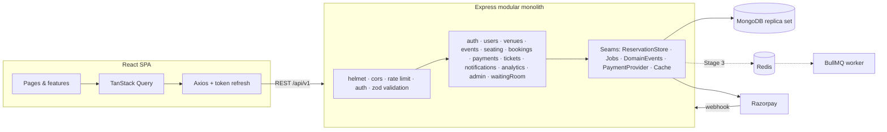

# TicketHub - High-Demand Event Ticket Booking Platform

A full-stack event ticketing platform (think a simplified BookMyShow / Ticketmaster) built with **React, Node.js, Express and MongoDB**, designed to evolve into a system that survives **high-demand ticket drops** where thousands of people compete for the same seats.

The project was built in three deliberate stages:

| Stage | Goal | What it contains |
|---|---|---|
| **1. Product** | A production-style MERN app with real business logic | Dynamic seat maps, temporary seat holds, a booking state machine, Razorpay payments + webhooks, QR tickets, organizer dashboards, gate check-in, cancellations & refunds, admin console |
| **2. Measure** | Find the real limits under load | k6 scenarios (browse storm, ticket drop), a hot-seat race script, a consistency checker |
| **3. Optimize** | Fix only what measurements show | Redis seat locks with TTL, BullMQ workers, Socket.IO live seat updates, virtual waiting room, Redis caching & rate limiting - each behind a config flag |

> Stage 1 and Stage 3 are the **same codebase**. Stage 3 upgrades are switched on with environment variables, so you can benchmark both architectures against each other.

---
## Project status

| Stage | Status |
|---|---|
| 1. Product | ✅ Complete and deployed - [Live demo](https://https://tickethubzone.vercel.app/) |
| 2. Load testing | 🔧 Test tooling ready (k6 scenarios, race script, consistency checker) - benchmarks in progress |
| 3. Optimization | 🔧 Redis / BullMQ / Socket.IO / waiting-room code implemented behind config flags - to be enabled and benchmarked after Stage 2 |

## Features

**Customers**: register/login · discover events (featured, popular, upcoming, categories, city) · search (debounced) · filter by city/category/date/price · sort by date/price/popularity · event details · interactive seat map · 5-minute seat hold with live countdown · coupons · Razorpay checkout · digital tickets with QR · printable tickets · booking history · policy-based cancellation with refund preview · notifications.

**Organizers**: venue layout builder (sections / rows / aisles with live preview) · events with ticket categories and prices · block seats · publish/unpublish/cancel (auto refunds everyone) · bookings table · analytics (sales over time, revenue by category, occupancy, attendance) · QR / manual ticket check-in.

**Admins**: platform stats · user management (roles, suspension) · organizer approvals · event moderation (suspend, feature, mark high-demand).

## Tech stack

| Layer | Tech |
|---|---|
| Frontend | React 19, Vite, Tailwind CSS v4, React Router, TanStack Query, Axios, React Hook Form + Zod, Recharts, qrcode.react, html5-qrcode |
| Backend | Node.js 20+, Express 5, Mongoose 8, Zod, JWT, bcrypt(js), Helmet, express-rate-limit, Pino |
| Database | MongoDB (replica set - uses multi-document transactions) |
| Payments | Razorpay (test mode) + a built-in mock gateway |
| Stage 3 | Redis (ioredis), BullMQ, Socket.IO, rate-limit-redis |
| Testing | Vitest, Supertest, mongodb-memory-server, k6 |

## Architecture at a glance



Detailed design: **[docs/ARCHITECTURE.md](docs/ARCHITECTURE.md)** · Interview prep: **[docs/INTERVIEW_GUIDE.md](docs/INTERVIEW_GUIDE.md)**

## Getting started

### Prerequisites
- Node.js 20+ and npm
- A MongoDB **replica set**: the free [MongoDB Atlas](https://www.mongodb.com/atlas) M0 cluster works, or `docker compose up -d mongo`
- (Optional) a Razorpay account in **test mode**
- (Stage 3 only) Redis: `docker compose up -d redis` or a free [Upstash](https://upstash.com) database

### Setup

```bash
git clone <your-repo-url> tickethub && cd tickethub
npm install                           # installs server + client (npm workspaces)

cp server/.env.example server/.env    # then edit MONGODB_URI and JWT secrets
npm run seed                          # wipes the DB and loads demo data
npm run dev                           # API on :5000, web on :5173
```

Open http://localhost:5173.

| Role | Email | Password |
|---|---|---|
| Customer | user@tickethub.dev | User@1234 |
| Organizer | organizer@tickethub.dev | Organizer@1234 |
| Admin | admin@tickethub.dev | Admin@1234 |

Coupons: `WELCOME10`, `FLAT200`.

### Payments
- `PAYMENT_PROVIDER=mock` (default) shows a test gateway dialog: "Pay successfully" / "Simulate failure".
- `PAYMENT_PROVIDER=razorpay` uses real Razorpay Checkout in test mode. Set `RAZORPAY_KEY_ID`, `RAZORPAY_KEY_SECRET`, and for webhooks `RAZORPAY_WEBHOOK_SECRET` (expose your API with `cloudflared tunnel --url http://localhost:5000` and register `https://<tunnel>/api/v1/payments/webhooks/razorpay` for `payment.captured`, `payment.failed`, `refund.processed`).

## Scripts

| Command | What it does |
|---|---|
| `npm run dev` | API + web with hot reload |
| `npm run seed` | Reset DB and create demo users, venues, events, bookings, check-ins |
| `npm test` | Unit + integration tests (in-memory MongoDB replica set) |
| `npm run race -- --users 200` | Stage 2: 200 users try to hold the same seat at once |
| `k6 run load-tests/k6/browse.js` | Stage 2: read-heavy event-page storm |
| `k6 run -e EVENT=<id> load-tests/k6/ticket-drop.js` | Stage 2: full ticket-drop checkout flow |
| `node server/scripts/check-consistency.js <eventId>` | Verify no double bookings after a test |
| `npm run worker` | Stage 3: BullMQ worker process |

## Stage 3 switches (`server/.env`)

| Variable | Stage 1 | Stage 3 |
|---|---|---|
| `RESERVATION_STORE` | `mongo` | `redis` - atomic Lua seat locks with TTL |
| `QUEUE_DRIVER` | `inline` | `bullmq` - jobs in a worker process with retries |
| `CACHE_DRIVER` | `none` | `redis` - cached seat layouts / home page |
| `RATE_LIMIT_STORE` | `memory` | `redis` - shared across instances |
| `REALTIME_ENABLED` | `false` | `true` - Socket.IO seat & booking updates |
| `WAITING_ROOM_ENABLED` | `false` | `true` - virtual queue for `highDemand` events |

See **[docs/STAGE2_LOAD_TESTING.md](docs/STAGE2_LOAD_TESTING.md)** and **[docs/STAGE3_OPTIMIZATION.md](docs/STAGE3_OPTIMIZATION.md)**.

## Project structure

```
server/src
  config/          env validation (zod), constants/enums
  infra/           db, redis, logger, jobs (inline|bullmq), cache, realtime, payments (razorpay|mock), domain events
  middleware/      auth, role guard, validation, rate limits, error handler
  modules/         auth · users · venues · events · seating · bookings · payments · tickets
                   notifications · analytics · admin · waitingRoom   (routes → controller → service → model)
  jobs/registry.js background jobs (hold sweeper, refunds retry, reminders, notifications, admission)
  app.js · server.js · worker.js
client/src
  app/             router, route guards
  layouts/         public + dashboard layouts
  features/        auth · discovery · events · seating · booking · tickets · account · organizer · admin · waitingRoom
  components/ui/   design system (Button, Dialog, DataTable, Skeleton ...)
  lib/             axios client with token refresh, formatting, socket
load-tests/k6      k6 scenarios
docs/              architecture, interview guide, stage 2 & 3, deployment
```

## Deployment

See **[docs/DEPLOYMENT.md](docs/DEPLOYMENT.md)** (MongoDB Atlas + Render + Vercel).

## License

MIT
